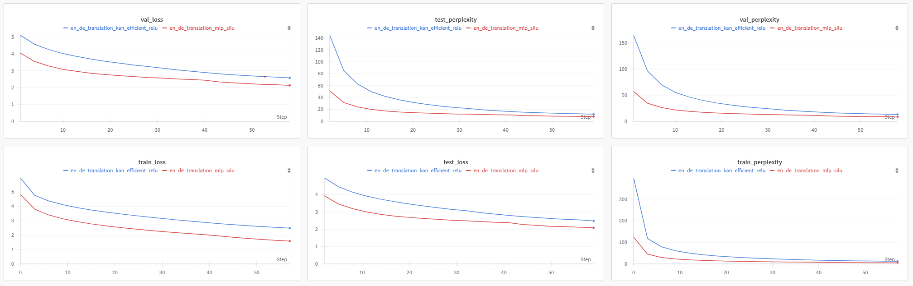

# kanformer

Kolomogorov-Arnold networks were recently proposed as a promising alternative to MLPs. This repository naively replaces linear layers of the [original transformer](https://arxiv.org/abs/1706.03762) implementation with KANLinear layers.

This repository is a toy playground for experimentation as I work my way through understanding more about KANs. I have a few ideas based on my current understanding on improving the architecture but so far everything performs worse in comparison to the original transformer with similar-ish parameter count. My next steps are to convert my dirty implementation of HF transformers GPT-KAN that looked somewhat promising and make available soon hopefully. Feel free to contribute if you find this interesting.

First run after making the KAN linear replacement:



### Installation

```bash
# Clone repository
git clone --recurse-submodules https://github.com/a-r-r-o-w/kanformer
cd kanformer

# Install python package
pip install -r requirements.txt
pip install .  # or "pip install -e ." for editable mode
python3 setup.py develop
```

### Usage

```py
import torch
from kanformer import EncoderDecoderTransformer

# mlp
model = EncoderDecoderTransformer(
    num_encoder_layers=3,
    num_decoder_layers=3,
    vocab_src_size=5000,
    vocab_tgt_size=5000,
    pad_src_idx=1,
    pad_tgt_idx=1,
    embedding_dim=512,
    query_key_dim=512,
    value_dim=512,
    num_heads=8,
    ffn_hidden_dim=768,
    ffn_activation="relu",
    dropout_rate=0.1,
    max_length=2048,
    model_type="mlp"
).to("cuda")
print(sum(p.numel() for p in model.parameters() if p.requires_grad)) # 21858816

# KAN efficient (https://github.com/Blealtan/efficient-kan/)
model = EncoderDecoderTransformer(
    num_encoder_layers=3,
    num_decoder_layers=3,
    vocab_src_size=5000,
    vocab_tgt_size=5000,
    pad_src_idx=1,
    pad_tgt_idx=1,
    embedding_dim=128,
    query_key_dim=128,
    value_dim=128,
    num_heads=8,
    ffn_hidden_dim=512,
    ffn_activation="relu",
    dropout_rate=0.1,
    max_length=2048,
    use_kan_bias=True,
    model_type="efficient_kan"
).to("cuda")
print(sum(p.numel() for p in model.parameters() if p.requires_grad)) # 21446400

batch_size = 32
seq_length = 512
en_tensors = torch.randint(0, 5000, (batch_size, seq_length)).to("cuda")
de_tensors = torch.randint(0, 5000, (batch_size, seq_length)).to("cuda")

output = model(en_tensors, de_tensors)
print(output.shape)  # (batch_size, seq_length, vocab_tgt_size)
```

<details>
<summary> Training </summary>

Currently, there are various limitations with the codebase that will be improved soon. For experimentation, Multi30k has been hardcoded. TODO: remove

```bash
# MLP
python3 main.py train \
  --num_encoder_layers=3 \
  --num_decoder_layers=3 \
  --vocab_src_size=5000 \
  --vocab_tgt_size=5000 \
  --pad_src_idx=-1 \
  --pad_tgt_idx=-1 \
  --embedding_dim=512 \
  --query_key_dim=512 \
  --value_dim=512 \
  --num_heads=8 \
  --ffn_hidden_dim=768 \
  --ffn_activation="relu" \
  --use_ffn_bias_1 \
  --use_ffn_bias_2 \
  --dropout_rate=0.1 \
  --max_length=32 \
  --weight_initialization_method="kaiming_uniform" \
  --learning_rate=1e-4 \
  --weight_decay=0.0001 \
  --batch_size=32 \
  --dataset_name="multi30k" \
  --epochs=20 \
  --seed=42 \
  --validation_epochs=1 \
  --checkpoint_path="checkpoints" \
  --experiment_name="en_de_translation_mlp_relu" \
  --checkpoint_steps=5000 \
  --gradient_accumulation_steps=1 \
  --model_type="mlp" \
  --track_wandb

# Efficient KAN
python3 main.py train \
  --num_encoder_layers=3 \
  --num_decoder_layers=3 \
  --vocab_src_size=5000 \
  --vocab_tgt_size=5000 \
  --pad_src_idx=-1 \
  --pad_tgt_idx=-1 \
  --embedding_dim=128 \
  --query_key_dim=128 \
  --value_dim=128 \
  --num_heads=8 \
  --ffn_hidden_dim=512 \
  --ffn_activation="relu" \
  --use_kan_bias \
  --use_ffn_bias_1 \
  --use_ffn_bias_2 \
  --dropout_rate=0.1 \
  --max_length=32 \
  --weight_initialization_method="kaiming_uniform" \
  --learning_rate=1e-4 \
  --weight_decay=0.0001 \
  --batch_size=32 \
  --dataset_name="multi30k" \
  --epochs=20 \
  --seed=42 \
  --validation_epochs=1 \
  --checkpoint_path="checkpoints" \
  --experiment_name="en_de_translation_kan_relu" \
  --checkpoint_steps=5000 \
  --gradient_accumulation_steps=1 \
  --model_type="kan_efficient" \
  --track_wandb
```
</details>

<details>
<summary> Inference </summary>

```bash
python3 main.py inference \
  --checkpoint_path="checkpoints" \
  --experiment_name="en_de_translation_mlp_relu" \
  --input="A man in shorts and a Hawaiian shirt leans over the rail of a pilot boat, with fog and mountains in the background." \
  --top_p=0.7 \
  --temperature=1 \
  --sample \
  --max_length=100

# Output:
Input: A man in shorts and a Hawaiian shirt leans over the rail of a pilot boat, with fog and mountains in the background.
Output: <sos> ein mann in shorts und mit sonnenbrille lehnt sich über ein geländer des pp des grill s und einem motor blick über das blaues see . <eos>
Generated token indices: [0, 73, 93, 71, 731, 87, 90, 735, 995, 147, 207, 73, 1120, 326, 171, 326, 1387, 49, 87, 83, 557, 413, 207, 226, 1564, 1010, 14, 1]
```
</details>

### TODO

- [x] Implement transformer base
- [ ] Implement original KAN (https://github.com/KindXiaoming/pykan/)
- [x] Use Efficient KAN (https://github.com/Blealtan/efficient-kan/)
- [ ] Dataset agnostic training
- [x] wandb logging
- [ ] Implement RoPE
- [ ] Implement MoE
- [x] Checkpointing
- [x] Gradient accumulation
- [ ] MultiGPU support using HF ecosystem
- [ ] GPT and BERT variants among other common configs
- [ ] Improve docs
- [ ] Tests

```
@misc{liu2024kan,
      title={KAN: Kolmogorov-Arnold Networks}, 
      author={Ziming Liu and Yixuan Wang and Sachin Vaidya and Fabian Ruehle and James Halverson and Marin Soljačić and Thomas Y. Hou and Max Tegmark},
      year={2024},
      eprint={2404.19756},
      archivePrefix={arXiv},
      primaryClass={cs.LG}
}
```
